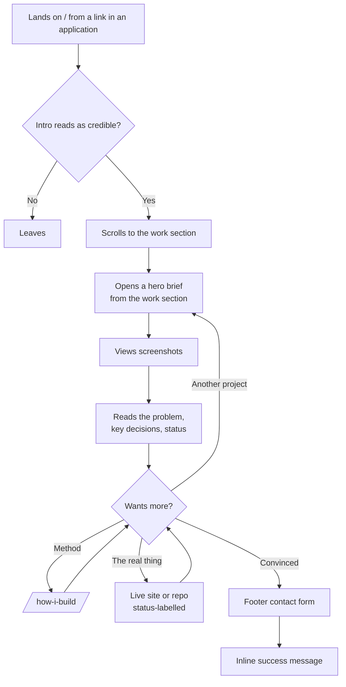

# User Flows — Gary Reyes Portfolio

**Status:** Confirmed
**Date:** 2026-08-28
**Amended:** 2026-09-04 — scope revision. 11 routes → 7 (the `/work`
index and 3 case-study routes removed); demo video → screenshots;
Monte Carlo simulator and GitHub contribution graph cut. See `CHANGES.md`.
**Reads from:** [`docs/PRD.md`](PRD.md) (user types, use cases),
[`ARCHITECTURE.md`](../ARCHITECTURE.md) (routes, entity)
**Feeds:** `roadmap-planner`, then the `feature-planner` build loop

There is **no authentication anywhere** in this project — no login, no
accounts, no gated screens. Every route is public and statically
generated. The auth-gate section of a normal flow map is therefore empty
by design, not by omission.

---

## Screen inventory — 7 routes

Counted explicitly so a partial list is visibly incomplete.

| # | Route | Purpose |
| --- | --- | --- |
| 1 | `/` | Home — intro, **about/IE**, **project list (`#projects`, the full list)**, footer |
| 2 | `/work/cornerman` | Hero project brief |
| 3 | `/work/ufc-scouting-app` | Hero project brief |
| 4 | `/work/saffron-web` | Hero project brief |
| 5 | `/services` | Business-owner page (secondary audience) |
| 6 | `/how-i-build` | The method — harness, skills, MCPs, CI gates |
| 7 | `/404` | Not found |

**Changed 2026-09-04:** the `/work` **index route is removed** — four
projects do not need an index; the homepage project list is the full
list. `/work` redirects to `/#projects`. Case-study routes are down to
**3** (one per hero). **Pahinga Coffee is a card**, not a route — it
renders in the homepage project list and on `/services`, and its card
links to its live site. `nfc-side-hustle` and `sports-bet-tracker` are
off v1.

**Changed 2026-09-10 (5a):** the homepage section order is **intro →
about → projects → footer** (Gary's call, was intro → work → about); the
section and its anchor are named **`#projects`** (was `#work`), and the
nav link reads **"Projects"**. The `/work/[slug]` brief URLs are
unchanged — those are *briefs*, the `/work/` prefix is incidental.

**Earlier changes still standing:** `/about` folded into a homepage
section; `/services` added.

**No `/contact` route.** Contact lives in the sitewide footer.
**No `/thanks` route.** Form success is an inline swap.

---

## Navigation convention

Stated as a deliberate decision, not a default — this is the detail most
often left unspecified until it is missing from a finished build.

**AMENDED 2026-09-10:** this section originally specified an `800k.dev`
-style hamburger opening a full-screen overlay menu (built in Phase 3c,
2026-09-07). It's retired — Gary's call, after an affaanmustafa.com
reference, in favor of plain always-visible links. The spec below is
current; the menu-contents tree and hamburger tradeoff writeup that used
to follow it are kept at the bottom of this section as history, not
current fact.

**Persistent top bar on every route:**

- **Left — wordmark.** Returns to the homepage intro ("Hello, I'm Gary
  Reyes, a 3rd-year Industrial Engineering student"). From a brief page
  this navigates to `/` and then scrolls to the intro; on `/` itself it
  scrolls to top.
- **Right — plain links, always visible**, no menu/overlay. Currently
  **Projects, Contact** (the only routes that resolve today — see the
  `NAV_LINKS` gate in `src/lib/site.ts`). **Services** re-adds at 5b and
  **How I build** at 5c; at four links, one of them long, that pass adds
  a mobile disclosure menu (a simple button + panel, not the retired
  full-screen docket). Every destination stays one click from every
  route — recognition over recall by construction.

Individual project links (the 3 hero briefs + Pahinga's live site) are
not in the nav bar — they live in the homepage project list itself
(`/#projects`), which the "Projects" link points to.

### Retired 2026-09-10 — kept as history, not current fact

The full-screen menu this section originally specified:

```
Menu (full-screen overlay)
├─ Work                          → /#work
│   ├─ 01  Cornerman             → /work/cornerman
│   ├─ 02  UFC Scouting          → /work/ufc-scouting-app
│   ├─ 03  Saffron               → /work/saffron-web
│   └─ 04  Pahinga Coffee        → pahinga-coffee.vercel.app (↗ external)
├─ Services                      → /services
├─ How I build                   → /how-i-build
├─ Contact                       → scrolls to footer
└─ GitHub · LinkedIn · Email     → external
```

Its accepted UX-floor tradeoff, also retired along with it: a hamburger
hides navigation, trading against *recognition over recall* — mitigated,
at the time, by listing every project inside the menu so it read as the
site's real navigation surface rather than a collapsed utility list. That
tradeoff no longer needs accepting, since nothing is hidden behind a
click anymore.

### Footer — sitewide, on every route

1. Contact form (Web3Forms) — the only contact surface on the site
2. Spec-sheet stat block — projects shipped, live in production, real
   client work, peak commit day (static, hand-maintained)
3. Résumé download link — *deferred; the résumé does not exist yet*
4. Socials — GitHub, LinkedIn, email

---

## Flow 1 — Startup founder (primary audience)

The flow the site exists for. This visitor is technically literate,
time-poor, skeptical, and forms a judgment in under two minutes.



**Screens involved:** `/` → `/work/[slug]` → optionally `/how-i-build` →
footer. **Three screens maximum** between landing and contact.

**Primary action per screen:**

| Screen | One obvious primary action |
| --- | --- |
| `/` | Open the work |
| `/work/[slug]` | Follow the live link / repo |
| `/how-i-build` | Return to the work |
| `/services` | Submit an inquiry |
| Footer | Send a message |

**Recognition over recall:** nothing in this flow requires remembering
anything from a previous screen. Project status (`live` /
`android-apk` / `archived`) is shown wherever a link appears, so a
visitor never has to recall which links are clickable.

---

## Flow 2 — Small-business owner (secondary audience)

Arrives almost always via a link Gary sends directly while pitching —
**not** via search and rarely via the homepage.

```
Direct link → /services → sees Pahinga + Saffron as proof
            → scrolls to footer form → inline success
```

`/services` must stand alone as a landing page, because for this audience
it is frequently the **first and only** page seen. It cannot depend on
context established on `/`.

**Contents:** what Gary builds for businesses, Pahinga and Saffron as the
proof, what working together looks like, and a direct route to the footer
form.

**Honesty constraint (PRD / `PROJECT_FACTS.md`):** `/services` may say
*available for freelance*. It must **not** imply *trusted by businesses* —
Saffron was real client work but unpaid, and there has been no paying
client yet.

---

## Flow 3 — Gary maintaining the site

```
Edit src/content/projects/<slug>.mdx → commit → PR → CI passes → merge → auto-deploy
```

No admin interface and no login. Editing content **is** the normal
development workflow. Adding another project means adding one `.mdx`
file (with `tier: hero` or `tier: card`) — no other change.

---

## Error and empty states

PRD §10 notes there are no data-driven empty states, since all content is
authored and static. That is true, and it is **not** the same as having no
failure states. These are the real ones.

| State | Required behaviour |
| --- | --- |
| **Form — idle** | Fields visible, submit enabled, no premature validation errors |
| **Form — submitting** | Button disabled with a pending indicator; double-submit impossible |
| **Form — success** | Form swaps in place for a confirmation. No navigation, no `/thanks` route |
| **Form — failure** | Visible error **plus a `mailto:` fallback**. Never a silent failure, never an endless spinner (PRD §10) |
| **Form — spam** | Honeypot field plus Web3Forms' own filtering |
| **Screenshots — default** | `loading="lazy"` with reserved dimensions. Nothing shifts as they load |
| **Screenshot — failed** | `alt` text shows; the brief still reads completely without the image |
| **Demo link — paused/dead** | Status label shown next to every link. `Cornerman` is `android-apk` and has **no** live URL — its card must not render a dead "Live demo" affordance |
| **Reduced motion** | All scroll and hover motion disabled; content fully readable and navigable |
| **JavaScript disabled** | Nav is plain links (no JS dependency at all, 2026-09-10). Hover previews, if/when built, are a React island — the site must remain **fully navigable and readable** without them |
| **Slow connection** | Text and layout render first. Screenshots never block first paint |
| **404** | Designed page with a route back to the homepage work section — not a bare message |
| **Deep link to a hero brief** | Every brief independently linkable with correct OG tags for previews |

---

## Footer stat block

A static spec-sheet block in the footer — a small set of hand-maintained
figures set as a manifest line: **projects shipped**, **live in
production**, **real client work**, **peak commit day**. No API call, no
build-time fetch, no JavaScript.

Replaces the GitHub contribution graph from the original plan, cut
2026-09-04: Gary's real figures (418 contributions across 23 of 370
active days, ~94% empty) would read as "inactive" to exactly the audience
the footer exists to persuade. Full reasoning in `PROJECT_FACTS.md`.

| State | Behaviour |
| --- | --- |
| Normal | Plain typography over 4–5 figures, baked into the page |
| No JS | Unaffected — it is static markup |

*(A client-side probabilistic-reasoning widget derived from UFC
Scouting's scoring lib — implied probability / edge / calibration — is a
possible post-launch "working functionality as content" element. Not v1.)*

---

## Handoff

**`docs/user-flows.md`** — 7 routes, three flows, navigation convention,
and every failure state. Revised 2026-09-04 for the scope change.

`/impeccable init`, `/impeccable new-work` (visual direction assigned),
and `roadmap-planner` have all run. `ROADMAP.md` is being re-segmented
for the scope change; then the `feature-planner` build loop starts at
Phase 3a.
