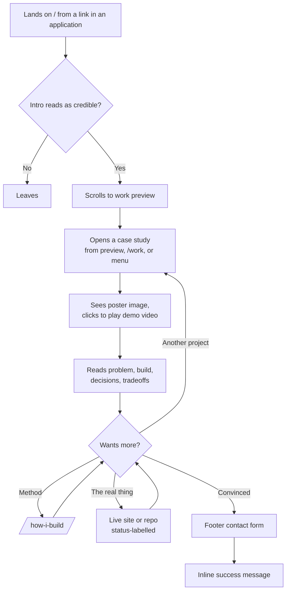

# User Flows — Gary Reyes Portfolio

**Status:** Confirmed
**Date:** 2026-08-28
**Reads from:** [`docs/PRD.md`](PRD.md) (user types, use cases),
[`ARCHITECTURE.md`](../ARCHITECTURE.md) (routes, entity)
**Feeds:** the design-direction step, then `roadmap-planner`

There is **no authentication anywhere** in this project — no login, no
accounts, no gated screens. Every route is public and statically
generated. The auth-gate section of a normal flow map is therefore empty
by design, not by omission.

---

## Screen inventory — 11 routes

Counted explicitly so a partial list is visibly incomplete.

| # | Route | Purpose |
| --- | --- | --- |
| 1 | `/` | Home — intro, work preview, about/IE, footer |
| 2 | `/work` | Project index, hover-preview grid |
| 3 | `/work/cornerman` | Case study |
| 4 | `/work/nfc-side-hustle` | Case study |
| 5 | `/work/saffron-web` | Case study |
| 6 | `/work/ufc-scouting-app` | Case study |
| 7 | `/work/sports-bet-tracker` | Case study — **carries the Monte Carlo simulator** |
| 8 | `/work/pahinga-coffee` | Case study |
| 9 | `/services` | Business-owner page (secondary audience) |
| 10 | `/how-i-build` | The method — harness, skills, MCPs, CI gates |
| 11 | `/404` | Not found |

**Changed from `ARCHITECTURE.md`:** `/about` is **removed** — folded into
a homepage section. `/services` is **added**. `ARCHITECTURE.md`'s folder
tree must be corrected to match.

**No `/contact` route.** Contact lives in the sitewide footer.
**No `/thanks` route.** Form success is an inline swap.

---

## Navigation convention

Stated as a deliberate decision, not a default — this is the detail most
often left unspecified until it is missing from a finished build.

**Persistent top bar on every route**, following the `800k.dev` pattern:

- **Left — wordmark.** Returns to the homepage intro ("Hello, I'm Gary
  Reyes, a 3rd-year Industrial Engineering student"). From a case study
  this navigates to `/` and then scrolls to the intro; on `/` itself it
  scrolls to top.
- **Right — hamburger**, opening a full-screen overlay menu.

### Menu contents — counted explicitly

```
Menu (full-screen overlay)
├─ Work                          → /work
│   ├─ 01  Cornerman             → /work/cornerman
│   ├─ 02  NFC Review Plates     → /work/nfc-side-hustle
│   ├─ 03  Saffron               → /work/saffron-web
│   ├─ 04  UFC Scouting          → /work/ufc-scouting-app
│   ├─ 05  Sports Bet Tracker    → /work/sports-bet-tracker
│   └─ 06  Pahinga Coffee        → /work/pahinga-coffee
├─ Services                      → /services
├─ How I build                   → /how-i-build
├─ Contact                       → scrolls to footer
└─ GitHub · LinkedIn · Email     → external
```

### UX-floor note on the hamburger — accepted tradeoff

A hamburger hides navigation, which trades against *recognition over
recall*: on desktop a visitor cannot see that `/services` or
`/how-i-build` exist until they open it.

**This is mitigated by listing all six projects inside the menu.** That
turns it from a collapsed utility list into the site's real navigation
surface — one click to any destination from anywhere. The pattern works
on `800k.dev` because the menu is a designed full-screen typographic
moment, and it must be built that way here. **It fails if it is just a
collapsed list.**

### Footer — sitewide, on every route

1. Contact form (Web3Forms) — the only contact surface on the site
2. GitHub contribution graph — custom monochrome dot matrix
3. Résumé download link
4. Socials — GitHub, LinkedIn, email

---

## Flow 1 — Startup founder (primary audience)

The flow the site exists for. This visitor is technically literate,
time-poor, skeptical, and forms a judgment in under two minutes.



**Screens involved:** `/` → `/work` or direct to `/work/[slug]` →
optionally `/how-i-build` → footer. **Four screens maximum** between
landing and contact.

**Primary action per screen:**

| Screen | One obvious primary action |
| --- | --- |
| `/` | Open the work |
| `/work` | Open a case study |
| `/work/[slug]` | Play the demo video |
| `/how-i-build` | Return to the work |
| `/services` | Submit an inquiry |
| Footer | Send a message |

**Recognition over recall:** nothing in this flow requires remembering
anything from a previous screen. Project status (`live` /
`android-apk` / `archived`) is shown wherever a link appears, so a
visitor never has to recall which demos are clickable.

---

## Flow 2 — Small-business owner (secondary audience)

Arrives almost always via a link Gary sends directly while pitching —
**not** via search and rarely via the homepage.

```
Direct link → /services → sees Pahinga + Saffron as proof
            → scrolls to footer form → inline success
```

`/services` must stand alone as a landing page, because for this audience
it is frequently the **first and only** page seen. It cannot depend on
context established on `/`.

**Contents:** what Gary builds for businesses, Pahinga and Saffron as the
proof, what working together looks like, and a direct route to the footer
form.

**Honesty constraint (PRD / `PROJECT_FACTS.md`):** `/services` may say
*available for freelance*. It must **not** imply *trusted by businesses* —
Saffron was real client work but unpaid, and there has been no paying
client yet.

---

## Flow 3 — Gary maintaining the site

```
Edit src/content/projects/<slug>.mdx → commit → PR → CI passes → merge → auto-deploy
```

No admin interface and no login. Editing content **is** the normal
development workflow. Adding a seventh project means adding one `.mdx`
file — no other change.

---

## Error and empty states

PRD §10 notes there are no data-driven empty states, since all content is
authored and static. That is true, and it is **not** the same as having no
failure states. These are the real ones.

| State | Required behaviour |
| --- | --- |
| **Form — idle** | Fields visible, submit enabled, no premature validation errors |
| **Form — submitting** | Button disabled with a pending indicator; double-submit impossible |
| **Form — success** | Form swaps in place for a confirmation. No navigation, no `/thanks` route |
| **Form — failure** | Visible error **plus a `mailto:` fallback**. Never a silent failure, never an endless spinner (PRD §10) |
| **Form — spam** | Honeypot field plus Web3Forms' own filtering |
| **Video — default** | Poster image, `preload="none"`. Nothing downloads until clicked |
| **Video — failed** | Poster remains with a visible note; the case study still reads completely without it |
| **Demo link — paused/dead** | Status label shown next to every link. `Cornerman` is `android-apk` and has **no** live URL — its card must not render a dead "Live demo" affordance |
| **Reduced motion** | All scroll and hover motion disabled; menu opens without animation; content fully readable and navigable |
| **JavaScript disabled** | Menu, hover previews, and the Monte Carlo simulator are React islands. The site must remain **fully navigable and readable** without them — menu falls back to plain links, simulator shows a static image or is hidden |
| **Slow connection** | Text and layout render first. Videos and the contribution graph never block first paint |
| **404** | Designed page with a route back to `/work` — not a bare message |
| **Menu open** | Focus trapped inside, `Esc` closes, background scroll locked, focus returns to the trigger |
| **Deep link to a case study** | Every case study independently linkable with correct OG tags for previews |

---

## The Monte Carlo simulator — `/work/sports-bet-tracker`

Lives inside its own case study, where it is contextually honest: that
project's actual mathematics, shown running rather than described. This
is the `800k.dev` move — working functionality as content — and the most
direct expression of "show, don't tell."

**Client-side only. No backend, so PRD §6 holds.**

| State | Behaviour |
| --- | --- |
| Initial | Sensible defaults already producing a result — never a blank chart awaiting input |
| Interacting | Redraws on input change; no submit button |
| Reduced motion | Redraws without transition animation |
| No JS | Static fallback image with a one-line caption |

**Should-have, never at the expense of the launch date.** If the deadline
tightens, this is the first thing cut.

---

## GitHub contribution graph — footer

Custom monochrome dot matrix rendered from build-time GitHub API data —
**not** a third-party image and **not** GitHub's green squares, which
would fight both the technical-drawing world and the "neutrals plus at
most one accent" rule.

> ⚠️ **Built against recommendation, with the data known.** Gary's real
> figures: **418 contributions across 23 active days out of 370** — the
> matrix will be ~94% empty, versus the 2,296-contribution reference that
> inspired it. The risk is that a sparse monochrome grid signals
> "inactive" to exactly the audience the footer exists to persuade.
> Decision recorded in `PROJECT_FACTS.md`; revisit once it can be seen
> rendered rather than described.

| State | Behaviour |
| --- | --- |
| Normal | Static inline SVG, baked at build |
| Build-time API failure | **Build must not fail.** Omit the graph, keep the profile link |
| No JS | Unaffected — it is inline SVG, not a script |

---

## Handoff

Written: **`docs/user-flows.md`** — 11 routes, three flows, navigation
convention, and every failure state.

Next, and it must happen now, before the first component exists:

1. **`/impeccable init`** — point it at `docs/PRD.md`; it translates
   rather than re-interviewing. **Omit its `## Stack` section** —
   `ARCHITECTURE.md` owns the stack.
2. **`/impeccable new-work`** — runs `concept-seed.mjs` to assign the
   visual direction from outside the model.

Then `roadmap-planner`.
